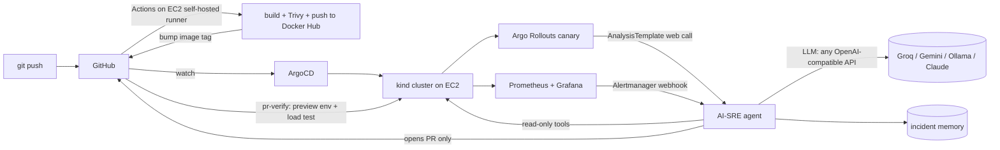

# AI-SRE GitOps

A GitOps platform on a single EC2 box with an **AI SRE that can only act through Git**.



## What you get

| # | Feature | Where |
|---|---|---|
| 1 | Terraform: EC2 + Docker + kind + Helm + ArgoCD bootstrap | `terraform/` |
| 2 | CI on the EC2 self-hosted runner: build, Trivy, push, tag bump | `.github/workflows/ci.yml` |
| 3 | App-of-apps: Prometheus, Grafana, Alertmanager, Argo Rollouts, demo app, agent | `gitops/` |
| 4 | **AI incident responder**: alert -> read-only investigation -> root cause -> PR | `agent/` |
| 5 | **AI canary analysis**: rules + LLM veto decide promote/abort | `agent/app/canary.py`, `analysis-template.yaml` |
| 6 | **Verify-before-merge**: preview namespace + load test commented on the PR | `pr-verify.yml`, `scripts/verify-preview.sh` |
| 7 | **Incident memory (RAG-lite)**: similar past incidents fed to the agent | `agent/app/memory.py` |
| 8 | **Deployment risk score + AI diff review** on PRs | `pr-risk.yml`, `scripts/pr_risk.py` |
| 9 | Guardrails: read-only RBAC, allow-listed + bounded keys, PR-only writes, one open AI PR, confidence gate, audit trace | `guardrails.py`, `rbac.yaml` |

## Prerequisites (local machine)

AWS CLI configured (`aws configure`), Terraform >= 1.5, git, make, ssh key (`ssh-keygen -t ed25519`), GitHub CLI (`gh auth login`), a Docker Hub account + access token, and a free LLM key (below).

## Step 1: your own GitHub repo

```bash
# create an EMPTY PUBLIC repo named ai-sre-gitops on GitHub, then:
cd ai-sre-gitops
git init -b main && git add . && git commit -m "initial"
make init GH_USER=<github-user> DH_USER=<dockerhub-user>   # fills placeholders
git add . && git commit -m "set usernames"
git remote add origin https://github.com/<github-user>/ai-sre-gitops.git
git push -u origin main
```
In the repo: **Settings > Secrets and variables > Actions** add secrets `DOCKERHUB_USERNAME`, `DOCKERHUB_TOKEN`, and (for PR risk review) `LLM_API_KEY`. Also set **Settings > Actions > General > Workflow permissions** to *Read and write* (CI pushes the tag bump).

Security note: a self-hosted runner on a **public** repo runs whatever workflows run. Do not accept fork PRs blindly; `pr-verify` already skips forks.

## Step 2: infrastructure (Terraform)

```bash
cp terraform/terraform.tfvars.example terraform/terraform.tfvars
# edit: allowed_ssh_cidr (your IP /32) and repo_url
make up        # ~2 min; creates EC2 and starts bootstrap
make wait      # ~5-8 min until kind + ArgoCD + root app are installed
make status    # ArgoCD apps
```
Bootstrap log: `ssh ubuntu@<ip> tail -f /var/log/ai-sre-bootstrap.log`. Terraform creates the kind cluster by running `kind` on the instance in user-data.

## Step 3: CI (runner + first build)

```bash
make runner                          # registers EC2 as self-hosted runner (uses gh CLI)
gh workflow run ci.yml               # builds demo-app + ai-sre-agent, pushes, bumps tags in gitops/
```
Watch the Actions tab. When done, ArgoCD picks up the new tags. Make sure the two Docker Hub repos are **public** (Docker Hub > repo > Settings) so the cluster can pull them.

## Step 4: look around

```bash
make tunnel          # keep this terminal open
make argocd-pass     # in another terminal
```
ArgoCD http://localhost:8080 (user `admin`), Grafana http://localhost:3000 (`admin`/`admin`, dashboard "Demo App - Canary & Health"), Prometheus http://localhost:9090, app http://localhost:8081, agent http://localhost:8800/healthz.

## Step 5: turn on the AI

1. Get a free key (see table) and create a fine-grained GitHub PAT: only this repo, **Contents RW + Pull requests RW**.
2. ```bash
   cp agent/.env.example agent/.env   # fill LLM_API_KEY, GITHUB_TOKEN, GITHUB_REPO
   make secrets
   curl localhost:8800/healthz        # {"llm": true, ...}
   ```
3. Smoke test without breaking anything: `make test-alert`, then `curl localhost:8800/incidents`.

| Provider | LLM_BASE_URL | Example LLM_MODEL |
|---|---|---|
| Groq (free tier) | `https://api.groq.com/openai/v1` | `llama-3.3-70b-versatile` (or `llama-3.1-8b-instant` if rate-limited) |
| Gemini (free tier) | `https://generativelanguage.googleapis.com/v1beta/openai/` | `gemini-2.5-flash` |
| GitHub Models | `https://models.github.ai/inference` | `openai/gpt-4.1-mini` |
| OpenRouter | `https://openrouter.ai/api/v1` | any `:free` model |
| Ollama | `http://<host>:11434/v1` | `qwen2.5:7b` |
| Claude (paid) | an OpenAI-compatible gateway/endpoint | your model |

Free tiers and model names change; check the provider page. The agent works without a key (collects facts only).

## Step 6: demos

**Demo A: AI canary stops a bad release**
```bash
make break-bad-release        # pushes ERROR_RATE=0.5
ssh in and run: kubectl get rollout,analysisrun -n demo
curl localhost:8800/canary/history
```
Flow: CI builds nothing (config only) -> ArgoCD syncs -> Rollout starts canary (25%) -> `ai-canary-verdict` calls the agent -> canary 5xx vs stable -> verdict `fail` -> Rollout aborts, stable keeps serving. Fix with `make reset-faults`.

**Demo B: OOM -> alert -> AI diagnosis -> PR -> verified -> merge**
```bash
make break-oom                # MEM_HOG_MB=150 vs 96Mi limit
```
Canary pod OOMKills -> `DemoAppOOMKilled` alert -> Alertmanager webhook -> agent reads pods/events/logs -> opens PR "raise memory limit" -> `pr-verify` deploys the PR to `preview-pr-N`, load-tests it and comments -> **you review and merge** -> ArgoCD rolls it out. Inspect: `curl localhost:8800/incidents` (root cause, trace of every tool call, PR URL, MTTR after resolve). Trigger it twice to see "similar past incident" memory kick in.

Between demos, `make reset-faults`. (If the agent's PR already raised the memory limit, that stays.)

## No laptop? Run it all from an EC2
See `docs/run-from-control-ec2.md`: a small control EC2 with an IAM role runs Terraform, which creates the kind-host EC2.

## Cost and cleanup

t3.large is roughly $0.08/h plus ~$3/month for the disk, so a few hours of testing is cents. **Always `make down` when done.** Set an AWS Budget alert. Use `use_spot = true` to save more. The EC2 public IP changes on every apply.

## Guardrails (why this is safe to demo)

- Cluster access is read-only RBAC; no secrets API; only `WATCH_NAMESPACES`.
- Writes only via GitHub PR; never pushes to `main`; max one open AI PR.
- Only 6 allow-listed keys, with bounds (memory 32Mi-1Gi, replicas 1-6, ...).
- Confidence < 0.6 is rejected; `AGENT_MODE=observe` disables all writes.
- LLM canary judge can only make a verdict stricter, never override a failed rule.
- Every tool call is stored in the incident trace (`/incidents`).
- Secrets live in a Kubernetes Secret created over SSH, never in git.

## Troubleshooting

- `make wait` hangs: read the bootstrap log. Usually a download failure; `terraform taint aws_instance.this && make up`.
- Pods `ImagePullBackOff`: CI hasn't run yet, or Docker Hub repos are private.
- ArgoCD app `Unknown`/repo error: repo must be public and placeholders replaced (`grep -r __GH_USER__ gitops`).
- Apps `OutOfSync` for Prometheus CRDs: `ServerSideApply` is on; give it a few minutes and retry sync.
- Rollout aborts with analysis *Error*: agent not running yet or unreachable; `analysis.enabled: false` in `values.yaml` temporarily.
- LLM 429s: use a smaller model, or reduce load; investigations are serialized and retried.
- Instance type unavailable in the first default subnet: pick another region/instance type.
- Port 8080 busy locally: edit the `-L` ports in the Makefile.

## Roadmap ideas

Predictive rightsizing (Prophet + OpenCost PRs), Chaos Mesh experiments generated by the agent, Loki log-pattern clustering after deploys (`gitops/optional/loki.yaml`), real embeddings + pgvector, Slack approve buttons, auto postmortems from incident traces, Sealed Secrets, remote Terraform state in S3.
